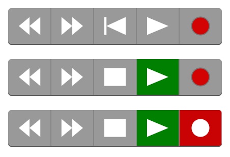

# svg-transport-controls

DAW transport controls as svg.



## Usage

```js
const controls = require('svg-transport-controls')
const html = require('bel')

document.body.appendChild(html`
  <svg>
    ${controls().render({
      width: 210,
      height: 35,
      playing: false
    })}
    ${controls().render({
      width: 210,
      height: 35,
      y: 50,
      playing: true
    })}
    ${controls().render({
      width: 210,
      height: 35,
      y: 100,
      playing: true,
      recording: true
    })}
  </svg>
`)
```

## License

MIT
